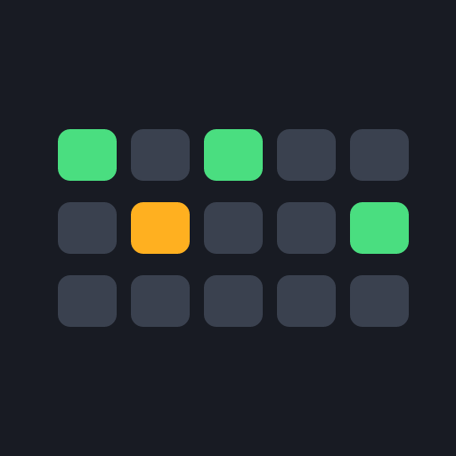
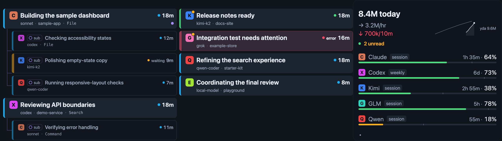
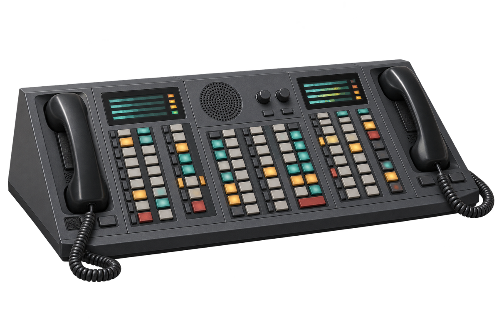

<p align="center">
  
</p>

# Dealerboard

Dealerboard is a macOS-local status board for coding agents. It turns provider
lifecycle signals into a private local session registry, while the companion
strip app shows who is working, waiting, finished, or failed—and lets you jump
back to supported sessions.

It is designed for the Corsair Xeneon Edge, but it also works as a normal
floating macOS window. Dealerboard is currently source-built and locally
configured; no signed or notarized binary release is provided.

<p align="center">
  
</p>
<p align="center"><em>Dealerboard on a 2560×720 strip display. All data shown is synthetic.</em></p>

## Why “Dealerboard”?

A [trading turret](https://en.wikipedia.org/wiki/Trading_turret)—also called a
dealer board—is a purpose-built desk console for seeing, prioritizing, and
acting on many live communication lines at a glance. Dealerboard borrows that
idea for coding agents: one dedicated surface for watching concurrent work and
jumping to the session that needs you.

<p align="center">
  
</p>
<p align="center"><em>An original illustration of a generic trading turret.</em></p>

## What it shows

- Live top-level sessions and their native or Paseo subagent trees.
- `working`, `waiting`, `idle`, and `error` state with elapsed timers.
- Finished results that stay on the board — viewing one elsewhere only clears
  its unread mark — until you flick or ack the card, restart the session, or
  the provider reports that the tab/session was closed or archived.
- Provider, model, project, and privacy-safe activity categories.
- Optional quota meters and daily token-usage trends.
- Tap-to-open for integrations with an exact route; a visible flash when no
  safe route exists.

Dealerboard is a live status surface, not a transcript viewer or historical
inbox. Dismissal hides a finished session while retaining its registry row
temporarily. Closed or archived sessions and their descendants are removed from
the registry immediately when the harness supplies that lifecycle signal.

## How it works

```text
provider hooks -> event helper -----\
app ack/clear -> session helper ------> SQLite registry
Evener + maintenance -> daemon ------/
                                      |
                                      v
                              daemon snapshots
                                  |       |
                                  v       v
                            macOS strip  deprecated
                               app       Stream Deck UI
```

Short-lived event/session helpers and the daemon write through independent
SQLite connections. Provider hooks send bounded JSON events; an authenticated
loopback AppWire client inside the daemon observes Evener. The daemon is the
only long-lived maintenance process and snapshot publisher.

## Requirements

- macOS. The current app does not declare a minimum macOS version.
- [Bun](https://bun.sh/) 1.3.14 (pinned in `package.json`).
- Rust 1.97.0 (pinned by `rust-toolchain.toml`).
- Xcode Command Line Tools for the Tauri/macOS build.
- Node.js 24+ is declared for the deprecated Stream Deck integration; the
  normal source workflow uses Bun.

The Xeneon Edge is recommended, not required. Dealerboard automatically pins
to a display whose model contains `Xeneon Edge` or whose physical resolution
is 2560×720. Without one, the window remains floating.

macOS touch support varies across external displays. Independent tools such as
[Touch-Base UPDD](https://www.touch-base.com/) and
[Touchscreen Gestures](https://www.touchscreengestures.com/) can provide or
improve touch input. They are examples rather than Dealerboard requirements or
endorsements. Use only one touchscreen driver or gesture tool at a time because
these tools may require exclusive control of the device.

## Quick start

Install dependencies and run the repository gate:

```bash
bun install
bun run check
```

Install the daemon, LaunchAgent, and any managed provider adapters whose home
directories already exist:

```bash
bun scripts/install-local.ts
```

Then configure each manual provider you use by following
[Provider hook configuration](docs/hook-configuration.md). Finally build and
install the Tauri app:

```bash
bun run install:app
open -a Dealerboard
```

Launching the app once enables its login autostart entry. Confirm that the
installed daemon can read its registry:

```bash
"$HOME/Library/Application Support/com.drewritter.dealerboard/bin/dealerboard" sessions list
```

The core and app installs are deliberately separate. Re-running
`bun scripts/install-local.ts` updates the daemon and managed adapters;
re-running `bun run install:app` replaces `/Applications/Dealerboard.app`.
The core installer refuses to downgrade over a registry schema newer than the
source checkout.

## Provider support

| Provider | Setup | Status | Primary-card tap |
| --- | --- | --- | --- |
| Claude Code | Manual hooks | Work, wait, finish, failure, background work, subagents | Focus the bound direct Ghostty terminal; otherwise flash |
| Codex | Manual local plugin plus hook trust | Work, approval wait, finish, subagents | Open `codex://threads/<session-id>` |
| Kimi Code/Web | Manual hooks | Work, question wait, finish, failure, interrupt, subagents | Open the local Kimi Web session |
| Pi | Installer-managed shim when `~/.pi` exists | Work, finish, and failure | Flash |
| oh-my-pi | Installer-managed shim when `~/.omp` exists | Work, question/approval wait, finish, native subagents | Flash |
| ZCode | Manual hooks | Work, approval wait, finish; one-hour stale lease | Flash |
| Grok | Installer-managed hook when `~/.grok` exists | Work, permission wait, finish, failure | Flash |
| Qwen Code | Manual hooks | Work, permission wait, finish, failure | Flash |
| Evener | Automatic local AppWire discovery | Inventory, work, question/escalation wait, finish, failure, archive removal, subagents | Flash |
| DeepSeek | Protocol/decoder support only; no public setup adapter | Depends on external event ingress | Flash |

A Paseo-origin card with a known agent reference overrides provider routing
and opens the corresponding Paseo agent. Native child cards are display-only;
Paseo child cards remain independently actionable. The tap already works for
sessions multiplexed under Paseo; other multiplexers could supply exact
routes the same way in the future.

Provider CLIs evolve. If a hook schema has changed, please open an issue with
the provider and version, but remove prompts, credentials, transcript contents,
and local identifiers from any diagnostic sample first.

## Interaction

- **Tap:** acknowledge the result, then open or focus the session where an
  exact route exists.
- **Long press:** Open, Ack, Reveal transcript, Copy session ID, or Clear
  session. Clear requires a second confirmation.
- **Horizontal fling:** move between board pages.
- **Rail pager dots:** jump directly to a page.

`Clear session` removes only Dealerboard's registry row. It does not delete a
provider transcript or close the provider session.

## Optional integrations

Dealerboard works without these helpers. Missing optional data simply stays
hidden. For the complete right rail, install
**[CodexBar](https://github.com/steipete/CodexBar)** for quota meters and
**[`agentsview`](https://github.com/kenn-io/agentsview)** for daily token
totals, rates, and trend curves; neither is required for the session board
itself.

- **Paseo:** supplies agent lineage, attention/view state, names, and exact
  `paseo://` routes.
- **Evener:** supplies local inventory and lifecycle state over authenticated
  AppWire v3.
- **[CodexBar](https://github.com/steipete/CodexBar):** supplies quota windows
  for Claude, Codex, Kimi, GLM/zai, and Qwen.
- **`cswap`:** adds privacy-safe numeric Claude account meters when two or
  more accounts are present.
- **[`agentsview`](https://github.com/kenn-io/agentsview):** supplies aggregate
  daily token totals and trend curves.
- **Ghostty:** enables exact Claude terminal focus for direct, non-tmux
  sessions.
- **[roborev](https://github.com/roborev-dev/roborev):** background review
  sessions identify themselves when roborev spawns Claude through the
  bundled shim. Point `claude_code_cmd` in `~/.roborev/config.toml` at
  `<repo>/scripts/roborev-claude-shim` (absolute path); identified cards
  wear the containment ring in cyan.

## Local data and privacy

Dealerboard is local-first. It has no telemetry or cloud service of its own.
Its application-support directory is mode 0700; the registry, snapshots,
managed hooks, and LaunchAgent are created with owner-only permissions.

| Data | Location |
| --- | --- |
| Application support | `~/Library/Application Support/com.drewritter.dealerboard/` |
| Installed daemon | `.../bin/dealerboard` |
| SQLite registry | `.../registry.sqlite3` |
| Session snapshot | `.../snapshot-v2.json` |
| Quota snapshot | `.../quota-snapshot.json` |
| Token snapshot | `.../token-usage-snapshot.json` |
| Logs | `.../logs/` |
| Daemon LaunchAgent | `~/Library/LaunchAgents/com.drewritter.dealerboard.plist` |
| App | `/Applications/Dealerboard.app` |
| App autostart | `~/Library/LaunchAgents/Dealerboard.plist` |

Provider payloads can contain sensitive material. Dealerboard allowlists the
fields it needs and does not persist prompt text, tool output, raw commands,
paths, searches, queries, URLs, or tool names as activity. Transcript tails
are read locally for titles, models, and a fixed category: `File`, `Command`,
`Search`, `Request`, or `Tool`. The transcript path itself is stored so the UI
can reveal the file and refresh those derived facts.

CodexBar, `cswap`, and `agentsview` output is reduced to bounded numeric or
label data; raw output and credentials are not stored or logged. Evener's
bearer capability stays in memory and is sent only to a loopback address.
Because it is sent in the initial WebSocket Authorization header, Evener
integration assumes other processes running as the same macOS user are
trusted.

## Troubleshooting

### Make sure exactly one daemon owns the registry

A daemon started from source uses the same production paths as the installed
LaunchAgent. Running both causes alternating writes and misleading UI state.

```bash
lsof "$HOME/Library/Application Support/com.drewritter.dealerboard/registry.sqlite3"
ps -ef | grep '[c]li.ts daemon'
```

Stop any source daemon you started. The normal owner is the installed
`.../bin/dealerboard daemon` process.

### Inspect the service and logs

```bash
launchctl print "gui/$(id -u)/com.drewritter.dealerboard"
tail -n 100 "$HOME/Library/Application Support/com.drewritter.dealerboard/logs/daemon.stderr.log"
```

An `OFFLINE` board means the session snapshot heartbeat is more than ten
seconds old. Check the LaunchAgent and logs first.

### A provider does not appear

Start a new provider session after installing its hooks, submit one prompt,
then run `sessions list`. Pi, oh-my-pi, and Grok are installed only when their
provider home directories existed during `install-local`; rerun the installer
after installing those providers. Codex command hooks must also be reviewed
and trusted after installation or any hook-definition edit.

## Uninstall

There is no automated uninstaller. First remove Dealerboard entries from the
manual provider configs listed in the provider guide. Do not delete an entire
provider `hooks` object if it also contains unrelated hooks.

Then unload the two services and remove Dealerboard-owned artifacts:

```bash
user_domain="gui/$(id -u)"
launchctl bootout "$user_domain/Dealerboard" 2>/dev/null || true
launchctl bootout "$user_domain/com.drewritter.dealerboard" 2>/dev/null || true

rm -f "$HOME/Library/LaunchAgents/Dealerboard.plist"
rm -f "$HOME/Library/LaunchAgents/com.drewritter.dealerboard.plist"
rm -rf "/Applications/Dealerboard.app"
```

Remove `dealerboard.ts` from Pi/oh-my-pi and `dealerboard.json` from Grok only
if the file still carries Dealerboard's managed marker. Finally, if you want
to erase the registry, snapshots, installed daemon, and logs:

```bash
rm -rf "$HOME/Library/Application Support/com.drewritter.dealerboard"
```

That last command permanently removes Dealerboard's local state.

## Development

| Command | Purpose |
| --- | --- |
| `bun run check` | Biome CI, TypeScript checks, daemon/plugin build, and Bun tests |
| `bun test` | Run the Bun test suite |
| `bun run typecheck` | Type-check daemon/plugin and app TypeScript |
| `bun run lint` | Run Biome checks |
| `bun run lint:fix` | Apply safe Biome fixes |
| `bun run format` | Format supported files |
| `bun run build` | Compile the daemon and bundle the deprecated plugin |
| `bun run build:app` | Build only the web frontend |
| `bun run dev:app` | Run the Tauri development shell |
| `bun run bundle:app` | Build the release `.app` bundle |

`bun run check` does not compile or test the Rust host. Before submitting an
app change, also run:

```bash
bun run build:app
cargo test --manifest-path app/src-tauri/Cargo.toml
bun run bundle:app
```

The pre-commit hook formats staged TypeScript/JSON/MJS and type-checks. The
pre-push hook runs `bun run check`.

### Repository layout

- `src/core/` — event decoding, registry, projection daemon, and collectors.
- `app/` — strip frontend and Tauri host.
- `extensions/` — installer-managed Pi, oh-my-pi, and Grok adapters.
- `src/plugin/` and `com.drewritter.dealerboard.sdPlugin/` — deprecated
  Stream Deck integration retained for regression coverage.
- `test/` — behavioral tests.

## Release scope

This repository is ready for source distribution. It does not currently ship
prebuilt daemon, app, or Stream Deck plugin artifacts. Binary distribution
still needs a target-specific third-party notice bundle; the macOS app also
needs Developer ID signing and notarization.

The Stream Deck integration is deprecated. It remains in `bun run build` so
its source keeps compiling, but the core installer does not deploy it and the
public source tree does not include a device-bound Stream Deck profile. Do not
run `bun run pack:plugin` as part of the supported setup.

## Security

See [SECURITY.md](SECURITY.md) for the trust model and private reporting
instructions.

## License

Dealerboard is available under the [MIT License](LICENSE).
